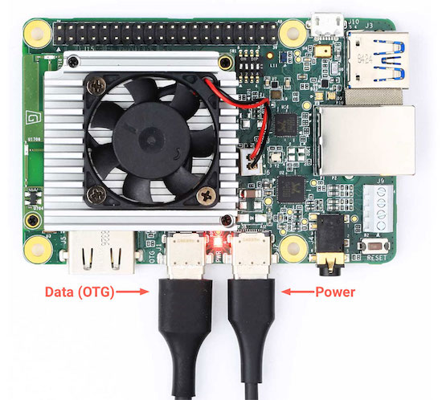

# Setup of Google Coral Device on MAC OS Catalina

This is a short text where I describe how to activate `ssh` and work
on a Google Coral Device board from your laptop remotely if you have
MAC OS Catalina. If you have tried to follow the instructions that you can
find on the official website where

[https://coral.ai/docs/dev-board/get-started/](https://coral.ai/docs/dev-board/get-started/)

you may have got to Section 2, where is described how to connect to
the board with MDT ([https://coral.ai/docs/dev-board/mdt/](https://coral.ai/docs/dev-board/mdt/)). MDT is the
**M**endel **D**evelopment **T**ool and should faciliate several operations
when using Mendel Linux distro (that you will install on the Coral Devices
    if you follow the instructions). According to the official website

>Mendel Development Tool (mdt) is a command-line tool that lets you communicate with a device  running Mendel Linux. The mdt command facilitates a variety of device actions such as opening a shell, installing Debian packages, pushing and pulling files, and more.

Now there is an important point. The official documentation states

> MDT can access the shell on any Mendel device that's **visible on your network**

Note the **visible on your network** part. If you follow the instructions you should
connect a data usb-c cable (how to recognize one is unknown at this point but that
    is for another post) to the data port

and then connect the cable to your
development machine (in our case your macbook probably). The connection
should basically create a network and make the device visible to your laptop.

Problem is that on Catalina connecting the USB-C cable does not do anything.
Not on my laptop and according to several posts I found also for many other
people. If you have a Linux machine is no problem, not on Catalina. So
you cannot activate `ssh` as the instructions explain. This may change in the
future so just in case, as I am writing, I have tested this with **Catalina
10.15.1**.

To do that you can do the following:

1. Open a Terminal and then type `screen /dev/cu.SLAB_USBtoUART 115200`
2. Connect the serial cable (see previous figure, or following the official instructions).
  If you have followed the instructions up to this point you should
  have done this already once.
 3. Once you connect the serial cable and turn on the Coral you should
 then see a few lines of text and then a login. You can login with the
 standard username/password: mendel/mendel.
 4. Start `sudo nano /etc/ssh/sshd_config` (**DISCLAIMER: note that allowing ssh with
     only password, as I am describing here, is not as safe as using keys,
     if you do it, please be aware of the risks in case you have sensible
     data or security is an issue for you. If you are unsure ask someone
     that can help you with that.**)
5. In the file change `PermitRootLogin prohibit-password`
   to `PermitRootLogin yes `
6. Then change `PasswordAuthentication no` to `PasswordAuthentication yes`
7. Restart the `ssh` demon with `sudo service ssh restart`
8. Don't forget to activate wifi on the coral device following the instructions
   on section 3. in the official documentation [https://coral.ai/docs/dev-board/get-started/](https://coral.ai/docs/dev-board/get-started/). Select the network on which your
   development machine (possibly your mac laptop) is so that the Coral is
   visible on the network.

You should be all set. The Coral will be reachable by ssh. Note that you will
need to know the name of the board that you got during the installation phase.
