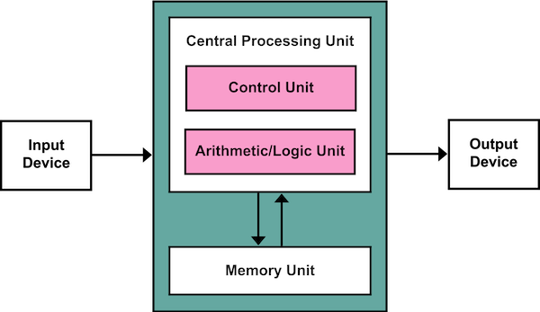

# How a [Central Processing Unit (CPU)](https://en.wikipedia.org/wiki/Central_processing_unit) is working - some notes

In this and the next sections we will not describe how a [CPU](https://en.wikipedia.org/wiki/Central_processing_unit) is working,
that would be way too complicated. But I would like to highlight a few
point that are relevant when comparing its speed with other kind of processing
units, as the [GPU](https://en.wikipedia.org/wiki/Graphics_processing_units)s and the [TPU](https://en.wikipedia.org/wiki/Tensor_processing_unit)s.

Basically, a [CPU](https://en.wikipedia.org/wiki/Central_processing_unit) performs the multiply-add operation by reading each input and weight from memory, multiplying them with its [ALU](https://en.wikipedia.org/wiki/Arithmetic_logic_unit),
writing them back to memory and finally adding up all the multiplied values [1].

A basic overview of how this may work can be understood with the
[Von Neumann architecture]((https://en.wikipedia.org/wiki/Von_Neumann_architecture)) (depicted in the Figure below)

**Figure 2.1.1**: the Von Neumann architecture (Source: [Wikipedia](https://en.wikipedia.org/wiki/Von_Neumann_architecture))

The basic problem of a cpu are mainly two

1. Sequential nature of the calculation
2. The fact that the [CPU](https://en.wikipedia.org/wiki/Central_processing_unit) has always to access memory to get new input and to
store the outputs

Point 1 can be somewhat alleviated by using more cores, although the number of
cores is normally relatively small and therefore this technique can
only alleviate point 1. Also possible is to increase clock rate or to introduce
advanced features like [branch prediction](https://en.wikipedia.org/wiki/Branch_predictor).

Point 2 is difficult to alleviate and several smart ideas are applied, as
cache memory (very fast memory for quickly getting data) faster buses, etc.

[1] https://blog.ml6.eu/googles-edge-tpu-what-how-why-945b32413cde

[>> (Next) Section 2.2](2-2-GPU.md)
