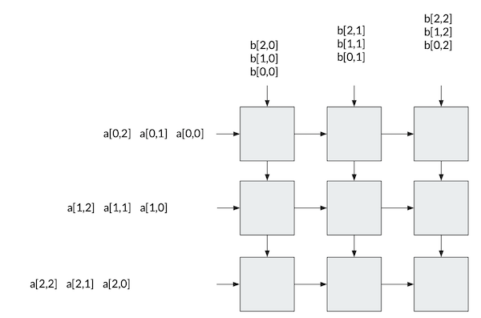
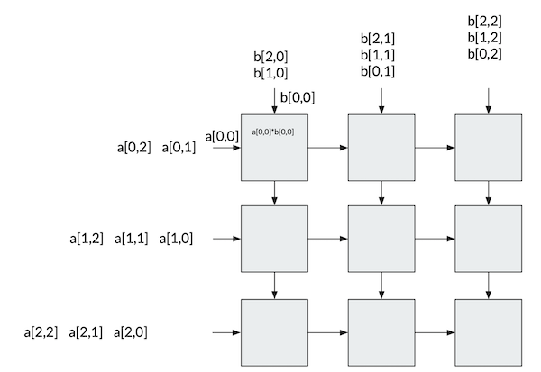
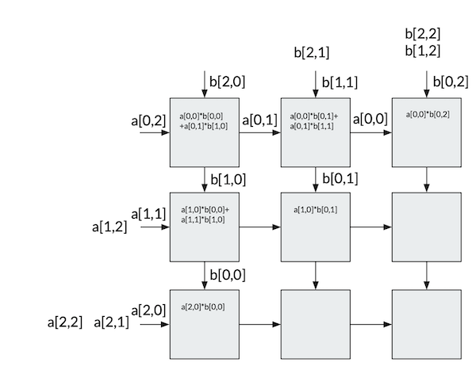
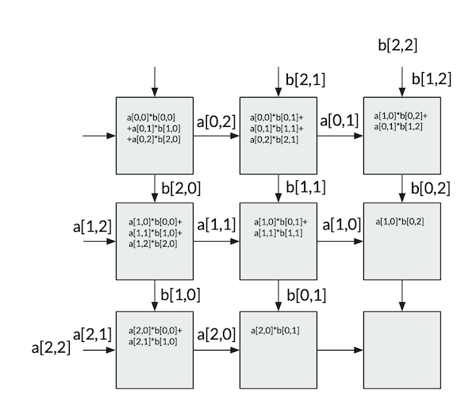

# How a [Tensor Processing Unit (TPU)](https://en.wikipedia.org/wiki/Tensor_processing_unit) is working - some notes

## Introduction

The TPU tries to solve the limitations of the [CPU](https://en.wikipedia.org/wiki/Central_processing_unit)'s and [GPU](https://en.wikipedia.org/wiki/Graphics_processing_units)'s' by
creating DPUs (**D**ata **P**rocessing **U**nits) that performs
one single task (and one only) and that exchange data between themselves
without the need of accessing the memory.

A [TPU](https://en.wikipedia.org/wiki/Tensor_processing_unit) operates very differently than a [GPU](https://en.wikipedia.org/wiki/Graphics_processing_units) or [CPU](https://en.wikipedia.org/wiki/Central_processing_unit). Its [ALU](https://en.wikipedia.org/wiki/Arithmetic_logic_unit)’s are directly connected to each other without using the memory. They can directly give pass information which will drastically decrease latency [2].

Let's consider the example of multipyling two matrices. All matrix elements
 are loaded into the [ALU](https://en.wikipedia.org/wiki/Arithmetic_logic_unit)'s. All the matrix elements does not get inserted into the [ALU](https://en.wikipedia.org/wiki/Arithmetic_logic_unit)’s at the same time but rather in a step-by-step basis from left to right and
 from top to bottom (a concrete example is below). This is all done with the methodology called [**systolic array**](https://en.wikipedia.org/wiki/Systolic_array) (see more info below).

## Systolic array

In the most basic form a [systolic array](https://en.wikipedia.org/wiki/Systolic_array) is (Source: [Wikipeda](https://en.wikipedia.org/wiki/Systolic_array))

> In parallel computer architectures, a systolic array is a homogeneous network of tightly coupled data processing units (DPUs) called cells or nodes. Each node or DPU independently computes a partial result as a function of the data received from its upstream neighbors, stores the result within itself and passes it downstream.

The main advantage is that the DPUs stores all the values without need to access
external buses or memory as in the case of a [CPU](https://en.wikipedia.org/wiki/Central_processing_unit) with a [Von Neumann architecture]((https://en.wikipedia.org/wiki/Von_Neumann_architecture). Such an array of DPUs is very very good at
one task and one only. That is at the same time its advantage and its disadvantage.

### Matrix multplication in systolic architecture - an example

Let's consider  two matrices that we want to multiply `A` and `B`, each
`3x3`. In a systolic architecture you will have, for example, 9 DPU (Data Processing
    Units) that will process data as soon as is available.

Note that there is no exchange of data between the DPUs and RAM. everything,
including data exchange, happens between the DPUs. In the following series
of Figures [1] you can see how each DPUs multiply and then add the results until
we have performed a complete matrix multiplication.

**Figure 2.3.1:** At the beginning the data is ready to be loaded in the
DPUs. Note how the data gets to the DPUs in a specific temporal order.

**Figure 2.3.2:** The first two values get digested by the upper left DPU.
`a[0,0]` and `b[0,0]` and get multiplied and saved in the DPU.

**Figure 2.3.3:** The data continue to flow horizontally and vertically.
You can see how, for example, `a[0,0]` flows to the next DPU that then will
use it with the next input from above `b[0,1]` (check the DPU in the
    upper row in the center).

**Figure 2.3.4:** The data continue to flow horizontally and vertically.
Each DPU continues to process the data it gets as input. Note how each
DPU is doing exactly the same task. There is no access to any memory
to check what tasks need to be done.

**Figure 2.3.5:** The data continue to flow horizontally and vertically.
When the input stops, for example the upper left DPU has no input anymore,
it does not do anything else. It just stores the result. The content of that
DPU is the first element of the resulting matrix.

**Figure 2.3.6:** The data continue to flow horizontally and vertically.

**Figure 2.3.7:** The data continue to flow horizontally and vertically.

**Figure 2.3.8:** The data continue to flow horizontally and vertically.

**Figure 2.3.9:** Now the matrix multiplication is finished and we have our
result.

[1] From: [http://www.cs.hmc.edu/courses/2001/spring/cs156](http://www.cs.hmc.edu/courses/2001/spring/cs156), Last accessed 18th
December 2019 11:03 AM

[2] https://blog.ml6.eu/googles-edge-tpu-what-how-why-945b32413cde

